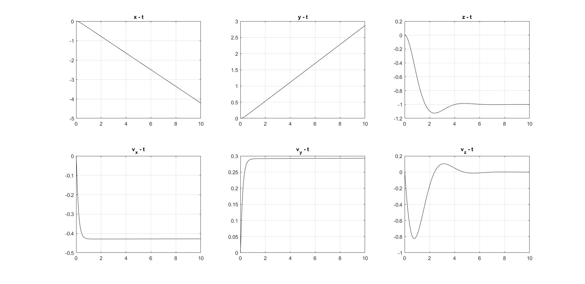

# TVC-aerodynamics-control

Equilibrium condition: The center of mass lies on the thrust line vector.

Hovering - COM mismatches the thrust line vector when the thrust vector is perpendicular to the ground.

